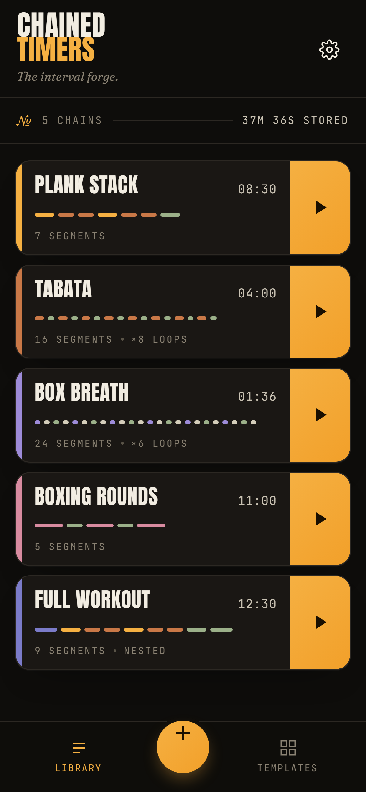
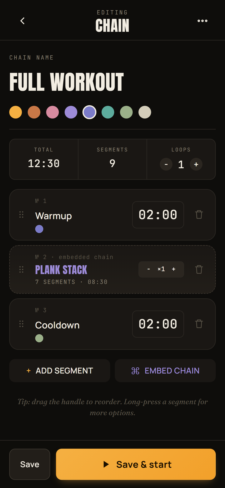
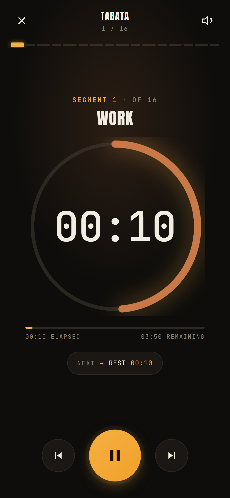

<div align="center">
  

# Chained Timers

**The interval forge.** Sequence intervals into named chains for sport, breathwork, cooking, study — anything paced.
A small, fast PWA that vibrates and notifies between segments and runs offline once installed.

[**→ Open the web app**](https://mayerwin.github.io/Chained-Timers/) ·
[Install as PWA](#install-as-pwa) ·
[Build native app (iOS / Android)](#build-the-native-app)

</div>

<div align="center">
  <table>
    <tr>
      <td width="33%"></td>
      <td width="33%"></td>
      <td width="33%"></td>
    </tr>
    <tr>
      <td align="center"><sub><b>Library.</b> Browse, run, edit.</sub></td>
      <td align="center"><sub><b>Editor.</b> Drag, nest, loop.</sub></td>
      <td align="center"><sub><b>Run mode.</b> Big numbers, cinematic.</sub></td>
    </tr>
  </table>
</div>

---

## What is it for?

A chain is a named sequence of countdown timers that fire one after the other, hands-free. The app vibrates, beeps, and sends a notification at each transition, then immediately starts the next segment. Use it for:

- 🏋️ **Interval training** — *"1m30 plank · 1m side L · 1m side R · 1m30 plank · 1m side L · 1m side R · 1m30 final hold"* — set it once, never tap snooze again.
- 🥊 **Tabata, EMOM, boxing rounds** — built-in templates, plus all the building blocks for your own.
- 🧘 **Breathwork** — *box breathing, Wim Hof rounds, 4-7-8.*
- 🍳 **Cooking** — *sear · rest · flip · rest · plate.*
- 🍅 **Pomodoro & deep work** — focus blocks chained with breaks.

The original idea — *"chained, snooze-free interval timers"* — comes from **[Mikaël Mayer](https://mikaelmayer.com)**.

---

## What makes it different

- **Chains, not just timers.** A chain is a first-class object — name it, color it, save it, run it again next week.
- **Embed chains inside chains.** Build a *full workout* by stitching together a *warmup*, your existing *plank stack*, and a *cooldown* — without retyping. Edit the inner chain, and every parent chain that uses it updates automatically.
- **Loop counts.** Repeat a whole chain *N* times, or just an embedded sub-chain.
- **One-tap reorder.** Drag handles for direct manipulation; cycle each segment's color with a tap.
- **Cinematic run mode.** Editorial display typography, tabular numerals, a calibrated amber accent, and a progression strip showing exactly where you are in the chain.
- **Pre-start countdown · final-3-second tick · long-press skip · instant pause.** All the controls a sweaty thumb needs.
- **Fully offline once installed.** Your library lives in `localStorage`, exportable to JSON.
- **No account, no tracking, no analytics.** Open the app, get to work.

---

## Install as PWA

The fastest way to use the app — no app stores, no developer accounts, no install size beyond a few KB.

| Platform | How |
| --- | --- |
| **iOS Safari**     | Tap the *Share* button → *Add to Home Screen*. |
| **Android Chrome** | Tap the *⋮* menu → *Install app* (or accept the prompt). |
| **Desktop Chrome / Edge** | Click the install icon in the address bar. |
| **Desktop Firefox / Safari** | No install — runs as a regular web app. |

Once installed, the app gets its own icon, runs offline, and can vibrate (Android) / show system notifications between segments while it's the active app.

---

## Build the native app

For true background reliability — segment notifications that fire when the screen is locked, the phone is in your pocket, the app has been swept away — the web platform isn't enough. The repo ships a [Capacitor](https://capacitorjs.com/) wrapper that re-uses the same web code inside a thin native shell, with access to:

- **Foreground service** (Android, custom plugin) — runs for the duration of the chain, holds a partial wake lock, and exempts the app process from Doze. Posts a persistent low-importance "▶ Now playing" notification showing current segment, position in chain, and what's coming next.
- **Native local notifications** (`@capacitor/local-notifications`) — the OS schedules each segment-end notification at chain start; they fire on time even with the app fully closed.
- **Native haptics** (`@capacitor/haptics`) — real vibration on iOS, where `navigator.vibrate` doesn't exist.
- **Native status bar** — themed to match the app's warm-black palette.

### Android — debug APK (free, no developer account)

Pre-built APKs are attached to every [GitHub Release](https://github.com/mayerwin/Chained-Timers/releases) and produced on every push to `main` as a workflow artifact you can download from the [Actions tab](https://github.com/mayerwin/Chained-Timers/actions). Sideload directly to any Android phone — no Play Store required.

To build locally:

```bash
git clone https://github.com/mayerwin/Chained-Timers.git
cd Chained-Timers
npm install
npm run cap:android       # opens Android Studio with the project ready to build
```

You'll need [Android Studio](https://developer.android.com/studio) (Hedgehog or newer) and JDK 21. From Android Studio: *Build → Build Bundle(s) / APK(s) → Build APK(s)*.

#### About the signing key

Every CI build is signed with the same committed keystore at [`android/sideload.keystore`](android/sideload.keystore). This is intentional — Android only allows in-place app updates when successive APKs are signed with the same cryptographic key, so without a stable keystore you'd have to uninstall before every update (and lose your saved chains). The keystore password is `sideload` and lives in plaintext in `android/app/build.gradle`. This is fine for sideload distribution because:

- **The signing key isn't a secret in this trust model.** Anyone could fork the repo and build their own APK signed the same way; that doesn't help them get on your phone unless you install their APK.
- **It's a stable identity, not an authorisation token.** Its purpose is to let Android say *"this APK and the previous one came from the same source"* — which for sideload means *"the same GitHub repo"*.

For Play Store distribution you'd replace the `signingConfigs.sideload` block with one backed by a private keystore + a `keystore.properties` file (already in `.gitignore`).

### Going to the App Store / Play Store

See [**PUBLISHING.md**](PUBLISHING.md) for the complete step-by-step recipe (keystore setup, signing configs, App Store Connect / Play Console flows, privacy policy text, screenshot requirements, common reviewer rejections).

### iOS — sideload or App Store

```bash
git clone https://github.com/mayerwin/Chained-Timers.git
cd Chained-Timers
npm install
npm run cap:add:ios       # one-time scaffold (requires CocoaPods on macOS)
npm run cap:ios           # opens Xcode with the project ready to build
```

**Distribution options:**
| Path | Cost | Limit |
| --- | --- | --- |
| Sideload to your own iPhone via Xcode + free Apple ID | free | re-sign every 7 days |
| Sideload via [AltStore](https://altstore.io/) | free | re-sign every 7 days |
| TestFlight (up to 10 000 testers, no review for builds) | $99/yr Apple Developer | 90 days per build |
| App Store | $99/yr Apple Developer | passes Apple review |

The $99/yr fee is unavoidable for any iOS app — native, Capacitor, React Native, etc. Apple does not allow free third-party distribution to other people's phones.

---

## Background behavior — what works, what doesn't

| | PWA — iOS | PWA — Android | Native — iOS | Native — Android |
| --- | --- | --- | --- | --- |
| Run with screen on, tab visible        | ✅ | ✅ | ✅ | ✅ |
| Keep screen awake during a run         | ✅ Wake Lock | ✅ Wake Lock | ✅ idle disabled | ✅ Wake Lock |
| Vibration between segments             | ❌ | ✅ | ✅ Haptics | ✅ |
| Notifications when app is closed       | ❌ | ⚠️ varies | ✅ scheduled at chain start | ✅ scheduled at chain start |
| Audio cues with screen locked          | ❌ | ⚠️ varies | ✅ | ✅ |
| Survives the OS killing the process    | ❌ | ❌ | ✅ — notifs are scheduled OS-side | ✅ — notifs are scheduled OS-side |

**Recommendation by use case:**
- *"I just want to use it from my browser sometimes"* → the PWA, with the screen on.
- *"I want a real workout timer that works when I lock my phone"* → install the native app via the APK / Xcode build.

### Android — if notifications still don't fire when the screen is locked

Open the app → ⚙ **Settings** → scroll to the **Native bridge** panel. It shows:

- `notifs: granted` — Android 13+ runtime notification permission (auto-prompted on first launch).
- `channel: ready` — the high-importance notification channel was created.
- `exact-alarm: granted` — **the critical one** for Android 12+ (see below).
- `background service: running / idle` — whether the foreground service holding the wake lock is currently active. Should read `running` while a chain is in progress.
- `battery: exempt / optimized` — whether Android's battery-optimization is allowed to kill the foreground service. Should read `exempt` for any time-critical chain.
- `last schedule: N notifications` — confirms the most recent chain wired its segment notifications into the OS.

Tap **Test in 10s**, lock the screen, and confirm the notification fires on time.

The native build runs a **foreground service** (`ChainTimerService`) for the duration of every chain. It holds an indefinite partial wake lock, exempts the process from Doze / App Standby, and posts a persistent low-importance "▶ Now playing" notification. As long as that notification is visible while you're running a chain, the timer will not freeze in the background and segment alarms will not be coalesced.

In addition, the bridge re-checks all permissions and re-issues the alarm queue every time the app comes back to the foreground, plus on a 4-minute heartbeat — so even if an alarm is silently lost (force-stop, OEM cleanup, Doze coalescing), the timer self-heals on the way through.

If the persistent notification *isn't* visible despite the chain running, three things commonly cause it:

**1. Exact-alarm permission denied (Android 12+).** Without `SCHEDULE_EXACT_ALARM` / `USE_EXACT_ALARM`, Android downgrades scheduled alarms to *inexact* — they can be delayed by 10+ minutes during Doze mode. The native build declares `USE_EXACT_ALARM` (auto-granted on Android 13+ for alarm/timer apps). On Android 12 the user can revoke it. If the panel shows `exact-alarm: denied`, tap **Fix exact alarms** — it opens *Settings → Special access → Alarms & reminders → Chained Timers* — toggle it ON.

**2. Battery-optimization restricting the app.** Tap **Allow background** in the Settings → Native bridge panel — it opens the system "Allow this app to run in the background" prompt. Choose *Allow* (or, equivalently, *Settings → Apps → Chained Timers → Battery → Unrestricted*). This is the single most common reason a chain goes silent on Samsung / Xiaomi / OPPO / Huawei / Vivo / OnePlus.

**3. OEM-specific extra restrictions.** Some manufacturers add a second layer beyond Android's standard battery optimization that the standard Android API can't toggle on the user's behalf:

- Samsung: *Settings → Device care → Battery → Background usage limits → Sleeping apps* and remove the app; also *Settings → Apps → Chained Timers → Battery → Unrestricted*.
- Xiaomi (MIUI): *Security → Permissions → Autostart → enable for Chained Timers*; and *Battery saver → No restrictions*.
- OPPO / Realme (ColorOS): *Settings → Battery → App management → Chained Timers → Allow background activity*.
- Huawei / Honor (EMUI): *Settings → Apps → Chained Timers → Battery → Launch → tick everything*.

Notifications are scheduled via `AlarmManager.setExactAndAllowWhileIdle` — the strongest "fire at this exact time, even in Doze" primitive Android exposes — and the foreground service plus partial wake lock keep the process alive so those alarms can fire on time.

### Using Chained Timers for time-critical scenarios (medication, sleep cycles, …)

Read this section if you intend to rely on the timer for something where a missed alert could matter.

What the app guarantees (with permissions granted and battery-optimization disabled, on stock Android):

- ✅ Wall-clock-correct timer math — every segment ends at exactly the right moment by `Date.now()`.
- ✅ A persistent system notification visible whenever a chain is running.
- ✅ Alarm-clock-grade exact alarms scheduled in advance for every segment boundary.
- ✅ Self-healing: alarms are re-checked on every app resume + every 4 minutes.
- ✅ Persistence: a chain that was running survives a force-stop, OOM kill, or device reboot.

What the app *cannot* guarantee, regardless of how much defensive code we add:

- ❌ **Battery dead** — no app will fire an alarm after the phone has shut down.
- ❌ **Phone in DND / Silent / Focus mode** — the OS may suppress sound on a delivered notification depending on your settings.
- ❌ **OEM "Pause this app" / "App Standby Bucket: Restricted"** — manual user action that strips the app of all background privileges.
- ❌ **App data cleared** by storage cleanup features.
- ❌ **OS bugs on extreme OEM ROMs** — some custom Android builds have been observed killing foreground services anyway, or silently dropping `setExactAndAllowWhileIdle` alarms.

For medication or other safety-critical timing, **always run a parallel backup**: a system-level alarm (the stock Clock app), a different physical timer, or a smartwatch reminder. No third-party Android app — including this one — can compete with stock Clock alarms for last-line-of-defence reliability.

---

## The chain editor in 30 seconds

1. Tap the **+** in the bottom bar.
2. Name the chain. Pick a color.
3. Tap **+ Add segment**, name it (*"Plank"*), tap the duration to set it (*1:30*).
4. Repeat. Drag the dotted handle to reorder. Tap the small color dot on a segment to cycle hues.
5. (Optional) **+ Embed chain** to nest another chain inside this one — useful for repeating sub-routines.
6. (Optional) Set **Loops** to repeat the whole chain N times.
7. **Save & start.**

Tapping a chain in the library re-opens it for editing; the play button on the card starts it immediately.

---

## Templates

The app ships with starter chains so you can run something useful in under 10 seconds:

- **Plank Stack** — 3 × (front plank · side L · side R), finished by a 90s hold.
- **Tabata** — 8 × (20s work · 10s rest).
- **EMOM 10** — 10 × 1-minute round.
- **Boxing Rounds** — 3 × (3m round · 1m rest), no rest after the last.
- **Pomodoro** — 25m focus · 5m break.
- **Box Breath** — 12 × (4s in · 4s hold · 4s out · 4s hold).

Tap any template to fork it into your library, then customize freely.

---

## Settings

Everything is on by default — turn off what you don't want.

- **Sound cues** — chime at each segment transition.
- **Voice cues** *(optional)* — speak the next segment name aloud (Web Speech API).
- **Vibration** — patterned buzz between segments + final-tick.
- **Keep screen awake** — Wake Lock during a run.
- **Pre-start countdown** — 3-2-1 before the first segment.
- **Final 3 seconds tick** — short ticks to mark the segment ending.
- **Notifications** — system notification at each transition (must be granted).
- **Export / Import library** — JSON, no account required.

---

## Tech notes

- **Web core** — vanilla HTML, CSS, JavaScript. No framework, no bundler, no runtime dependencies. ~30 KB of source.
- **PWA** — network-first service worker for HTML, cache-first for static assets.
- **Native shell** — [Capacitor 8](https://capacitorjs.com/) with `@capacitor/local-notifications`, `@capacitor/haptics`, and a small in-repo Android plugin ([`ChainTimerService`](android/app/src/main/java/com/mayerwin/chainedtimers/ChainTimerService.java) + [`ChainTimerPlugin`](android/app/src/main/java/com/mayerwin/chainedtimers/ChainTimerPlugin.java)) that drives a foreground service holding a partial wake lock for the duration of every chain. The web code is untouched in native builds; a tiny bridge in [`js/native.js`](js/native.js) listens for `chain:start` / `chain:cancel` / `chain:reschedule` / `chain:complete` events from the engine and forwards them to both the native local-notification scheduler and the foreground service.
- **Wall-clock engine** — the timer math is driven by `Date.now()`, never `performance.now()`, so the chain stays accurate to the second across screen-locks, app-switches, brief WebView freezes, and even out-of-process kills (a running chain is persisted to localStorage on every transition and restored on next launch).
- **Type display** — **Anton** + **Fraunces** + **JetBrains Mono** + **Manrope** via Google Fonts (preconnected).

### Local development

```bash
git clone https://github.com/mayerwin/Chained-Timers.git
cd Chained-Timers
npm install
npm run serve               # http://localhost:4321
```

### Tools

```bash
npm run icons               # rebuild PWA icons + social card
npm run icons:android       # rebuild Android launcher / status icons
npm run smoke               # capture every screen as a Playwright screenshot
npm run build:www           # bundle the runtime files into ./dist
npm run cap:sync            # build:www + npx cap sync (refreshes native projects)
```

### Project layout

```
index.html             ← PWA entry
css/styles.css         ← all styles (single file)
js/app.js              ← engine, store, UI, drag-and-drop, ~30 KB
js/native.js           ← Capacitor bridge — no-op in browsers
icons/                 ← SVG masters + generated PNG variants
sw.js                  ← service worker (cache strategy)
manifest.webmanifest   ← PWA manifest
capacitor.config.json  ← Capacitor project config
android/               ← native Android project (committed)
ios/                   ← native iOS project (run `npm run cap:add:ios` on a Mac)
.github/workflows/     ← CI: builds the Android debug APK on every push
```

---

## Hosting

The app is published to GitHub Pages from the `main` branch. The repo's `.nojekyll` file disables Jekyll so files in folders starting with `_` are served as-is.

To enable Pages on a fresh fork: **Settings → Pages → Source → Deploy from a branch → main / (root)**.

---

## Credits

- **Concept** — [Mikaël Mayer](https://mikaelmayer.com), who first articulated the idea of named chains of intervals as the natural unit for sport timing.
- **Design & code** — [Erwin](https://github.com/mayerwin), with assistance from Claude (Anthropic).
- **Type** — Anton (Vernon Adams), Fraunces (Undercase Type), JetBrains Mono (JetBrains), Manrope (Mikhail Sharanda).

## License

MIT — see [LICENSE](LICENSE).

---

<div align="center"><sub>Made with care. No accounts. No tracking. No ads. Just chains.</sub></div>
